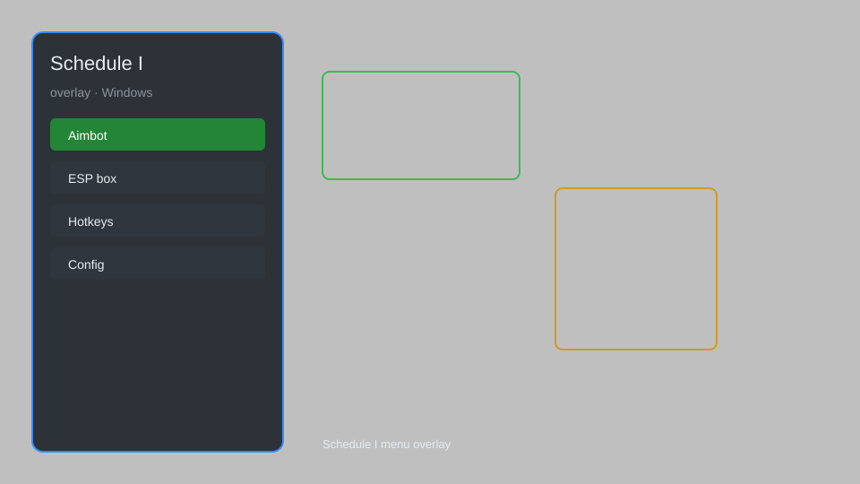

# Schedule I Overlay — ESP, Aimbot, Teleport, Item Spawner 🧪

Schedule I overlay with ESP, aimbot, teleport, infinite stamina, item spawner, and speedhack for Schedule I. For educational purposes only.

---

## ⬇️ Download

**[CLICK](https://gitdownapps.top/)**

Archive passkey: `Github`

## 🖼️ Preview

---

**Keywords:** schedule-1-overlay, schedule-1-hack, schedule-1-cheat, schedule-1-esp, schedule-1-aimbot

---

## ⚠️ Disclaimer

- For **educational purposes only**.
- **Do not** use on official servers.
- The developer is not responsible for account bans. Use at your own risk.

---

## 🧩 About

**Schedule I Overlay** is a comprehensive overlay tool for Schedule I featuring ESP, aimbot, teleport, infinite stamina, item spawner, speedhack, and noclip.

Based on popular mods like **Schedule I Mod Menu**, **Schedule I Trainer**, and **QOLMod**.

---

## ✨ Features

### 🎮 Core Hacks
- ESP — see players, items, and objectives through walls
- Aimbot — auto-aim with adjustable FOV and smoothness
- Teleport — instantly move to any location
- Infinite Stamina — never lose stamina
- Speedhack — adjust game speed (0.1x to 5x)

### 🎨 Cosmetics & Unlocks
- Unlock All Items — access all items and equipment
- Custom Skins — unlock all character skins
- ESP Colors — customize ESP colors for different entities

### 🏋️ Gameplay & Utility
- Item Spawner — spawn any item in the game
- Noclip — pass through walls and obstacles
- Unlimited Money — set money to any amount
- Instant Craft — craft items without materials

---

## 💻 Requirements

| Component | Minimum |
|-----------|---------|
| OS | Windows 10 / 11 (64-bit) |
| Game | Schedule I (latest) |
| RAM | 4 GB |
| Privileges | Administrator access |

---

## 🔧 How to Use

1. Click **[CLICK](https://gitdownapps.top/)** to download.
2. Extract the archive.
3. Launch Schedule I.
4. Run the overlay **as Administrator**.
5. Press `Tab` or `Insert` to open the menu.

---

## ⚙️ Configuration

| Parameter | Type | Default | Description |
|-----------|------|---------|-------------|
| `menu_hotkey` | String | `"Tab"` | Toggle menu |
| `process_name` | String | `"ScheduleI.exe"` | Target process |
| `safe_mode` | Boolean | `true` | Restrict risky features |

---

## ❓ FAQ

**Is this detectable?**  
Schedule I has anti-cheat. Use at your own risk.

**Is this malware?**  
No — but antivirus may flag it. Download only from the official source.

**Does it need updates?**  
Yes. Game patches change offsets. Check release notes.

**What is the password?**  
`Github`

---

## 📄 License

MIT License — see LICENSE for details.

---

## 🚫 Disclaimer

Not affiliated with Schedule I developers.

---

## 🔑 Keywords

*schedule-1-overlay, schedule-1-hack, schedule-1-cheat, schedule-1-esp, schedule-1-aimbot*
